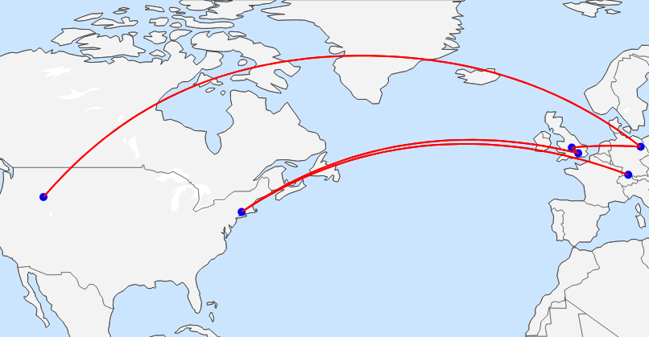

# Sebastian Dunn's Resume

### Contact Information
- [sebastiancdunn@gmail.com](mailto:sebastiancdunn@gmail.com)
- [LinkedIn](https://www.https://www.linkedin.com/in/sebastian-dunn/)

## Education
**Brigham Young University - Idaho**  
*B.Sc. Computer Science*  
Major GPA: 3.9 / 4.0
Sept 2021 - Dec 2024

**Leadership and Awards**:  
- Data Science Society Project Manager

## Experience

### [Boxiecat](https://boxiecat.com/)
**Data Science Intern**  
Rexburg, ID 
April 2024 - Current

### [Cadwell Inc.](https://www.cadwell.com/)
**Software Engineer Intern**  
Kennewick, Washington 
May 2023 - August 2024

### [English Department - Brigham Young University - Idaho](https://www.byui.edu/english/)
**Teacher's Assisstant**  
Rexburg, Idaho
Sept 2023 - July 2023

### [Computer Science Department - Brigham Young University - Idaho](https://www.byui.edu/computer-science-engineering/)
**Volunteer Tutor & Teacher's Assisstant**  
Rexburg, Idaho
January 2022 - December 2022

### Freelance/Contract
**Software Solutions Consultant**  
Rexburg, Idaho
August 2021 - Current

## Skills

**Programming Languages**
- **Python**: Pandas, PySpark, Jupyter, Polars, bs4, Playwright, Selenium, lxml  
- **C#**: WPF, DevExpress, Seq, .NET Framework/Core, Azure SDKs, Blazor, Maui, ASP.NET  
- **R**: Tidyverse  

**Cloud Platforms & Frameworks**
- **Google Cloud**: Cloud Storage, Cloud Run, Functions, Scheduler, EventArc, IAM, Apps Script  
- **Azure**: Blob Storage, CosmosDB, App Service, Functions  

**Data Visualization & Tools**
- Streamlit, Tableau, Databricks, ggplot2, matplotlib, seaborn, plotly  

**Other Technical Skills**
- SQL, Git (GitHub, Azure DevOps), Docker, CRON Jobs, Quarto, LaTeX  
- MVVM, Event-Driven Architecture, Single-Page Applications (SPA)  

---

# Did you know?

### Sebastian Dunn moved between countries 5 times?

More Detail?

Singen, Germany → Connecticut, USA after 1.5 months

Connecticut, USA → Ascot, United Kingdom after 7.5 years

Ascot, United Kingdom → Dorridge, United Kingdom after 2.5 years

Dorridge, United Kingdom → Berlin, Germany after 1 year

Berlin, Germany → Idaho, USA after 6 years

### Sebastian can work in both the EU & the USA without any Visa assistance?
(he has dual citizenship in Germany & the USA plus he can speak both German & English)

### Sebastian won second place at his school's Hackathon
(they say second place is the first something... i don't remember what)
